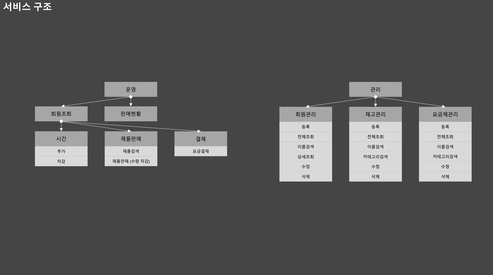
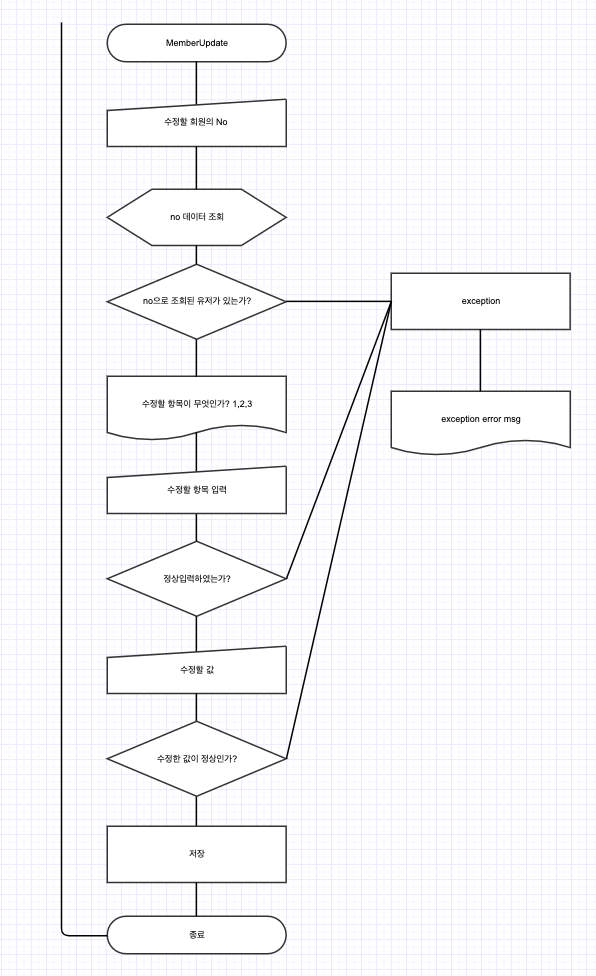
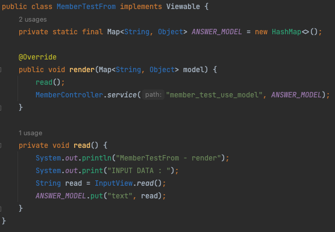
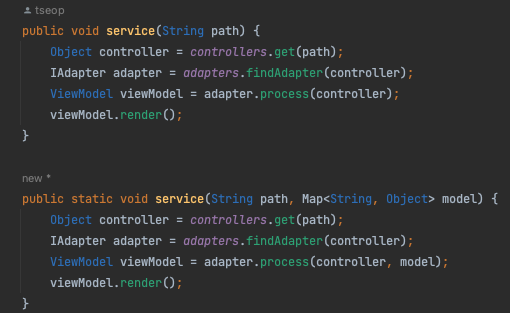

# ToyProject - PC방 관리

## 스토리
pc방은 어릴적 한번쯤은 가봤을 법한 장소이다. 내가 어렸을 적 pc방은 지금과는 다소 다른 모습을 하고 있었다.  
시간을 추가하기 위해서는 반드시 데스크에서만 추가할 수 있었고 선불과 후불이 있었다. (후불은 보통 성인만 가능했다)  
시간 당 약 1,000원 정도의 금액이고 2,000원을 내면 정액제를 통해 3시간을 할 수 있었다.  
특별한 점은 그닥 없었지만 성인의 경우 후불제로 이용을 하면 음식들을 후불로도 먹을 수 있었다.
pc방 아르바이트나 사장님과 친해지기만 한다면 때때로 뜻밖의 선물을 받을 수도 있었다.

그러나 현재의 pc방은 대부분의 결제를 자리에서 하거나 키오스크를 통해서 하고 있어   
아르바이트나 사장님과는 친해지는게 전과는 달리 어려워진 면이 있다.  
과거의 향수를 받아 옛날 pc방의 관리 모듈을 만들자, MVC 패턴을 준수하고 오직 JAVA로만 구현을 해야 한다.

## 구조도

## 기능목록
- [ ] 운영
  - [ ] 시간
    - [ ] 시간추가
    - [ ] 시간차감
  - [ ] 제품판매
    - [ ] 제품검색
      - [ ] 제품 판매
  - [ ] 결제
    - [ ] 요금결제
  - [ ] 판매현황

- [ ] 관리
  - [ ] 회원
    - [X] 등록
    - [X] 전체조회
    - [X] 이름조회
    - [X] 상세조회 // 삭제
    - [X] 삭제
    - [X] 수정
  - [ ] 재고
    - [X] 등록
    - [X] 전체조회
    - [X] 이름조회
    - [X] 카테고리조회
    - [ ] 수정
    - [X] 삭제
  - [ ] 요금제
    - [ ] 등록
    - [ ] 전체조회
    - [ ] 이름조회
    - [ ] 카테고리조회
    - [ ] 수정
    - [ ] 삭제

## 프로세스
_기능 프로세스는 시간상 일부 기능만 작성._

**[회원 수정]**

## history
2023.01.02 :  
MVC 패턴 구현을 위해 Model Controller View 영역을 나누고 회원관리에서 수정을 제외한 기능을 구현하였다.  
잘 했는지를 모르겠으나 패턴 구현 후 단순히 비즈니스 로직과 view 영역만 작성을 하면 기능이 작동이 된다.  
자세한 내용은 블로그에 회고를 하도록 한다.

2023.01.03 :   
재고관리를 구현하기 위해 어제 작성한 회원관리의 코드 중 공통으로 사용 가능한 adapter, interface 등의 클래스명을 범용적으로 사용할 수 있도록 변경하였다.  
기능을 클래스별로 나누어 작성을 하였는데 기능 클래스명이 controller로 되어 있었던 것을 function 으로 변경하며 폴더를 구분하였고 이로 인하여 폴더 복잡도는 한층 괜찮아졌다.
공통으로 사용되는 기능들은 common 폴더를 생성하여 관리를 시작했다.

2023.01.04 :  
요즘제 관리를 구현하기 전 다른 기능을 먼저 구현하려고 한다.
회원관리 중 업데이트 기능을 구현하면서 문제점이 발생하였다.  
현재는 사용자로부터 입력을 받는 것을 function에서 처리를 하고 있으나  
이 부분은 이제 view에서 처리를 하도록 리팩토링을 할 것이다.
근데 view에서 사용자의 입력을 받게되면 값을 model로 저장하여 컨트롤러로 path와 함께 넘겨야한다.  
스프링에서는 웹으로 구현하여 처리하는데 문제가 없었으나 자바만으로 구현을 하기 위해서는 이 부분을 어떻게 해야할지 감이 서지 않는다.

2023.01.05 :   
1월 4일 문제였던 수정과 입력 값을 View에서 받아 처리하는 것을 해결했다.
view에서 값을 입력받고 컨트롤러로 맵핑하는 문제는 깔끔하게 처리하지는 못한 것 같다.
web과 비슷한 방식으로 처리를 하고자 view에서 입력을 받으면 Map에 넣고 컨트롤러를 호출을 한다.
이에 따라 Map 객체를 받아서 처리가 가능하도록 Controller에서 service 메소드를 오버로딩하여 static으로 선언했다.

------------------------------------------------------- __[TestView]__ -------------------------------------------------------

------------------------------------------------------- __[MemberController]__ -------------------------------------------------------

현재 이 프로젝트는 많은 기능들이 특정 값을 입력 받은 후 로직이 작동해야 하므로 필요에 따라 입력을 받는 form으로 연결이 되도록 수정 해야한다..

2023.01.06 : 
view에서의 컨트롤러를 직접적으로 매핑하는 로직은 abstract class 를 이용하여 분리를 하였다.
ViewForm 클래스는 범용적인 사용을 위해 setup을 해줘야하는 항목들이 좀 많은게 걸린다..
이는 추후에 해결을 하는 것으로 하고 지금은 member의 모든 기능에서 view에서 입력값을 받고 값을 controller로 값을 전달하도록 코드를 수정하자.
또한 2023.01.05에 만들어둔 service 메소드를 mapping 으로 변경하였으며 static 선언도 제거했다.
또한 view에서 입력 값을 받기 위한 구조로 Form과 관련된 view 객체가 늘어났고 controller에서 처리하는 일이 많아졌다.
이는 enum으로 분리하여 책임을 분리할 수 있을 것으로 생각되니 추후에 수정을 해보도록 하자